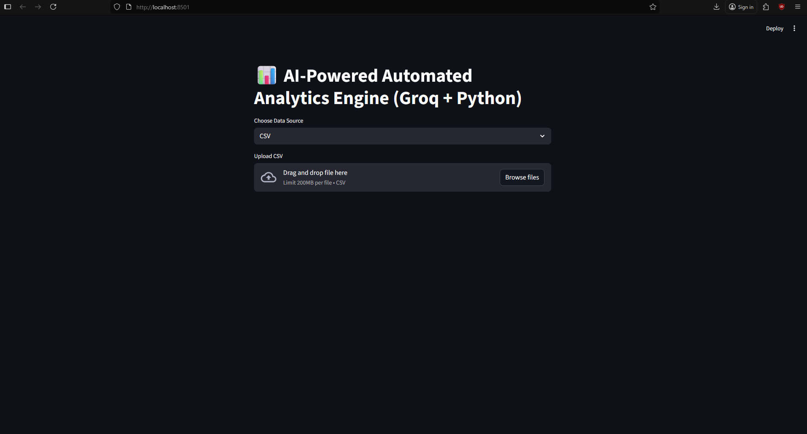
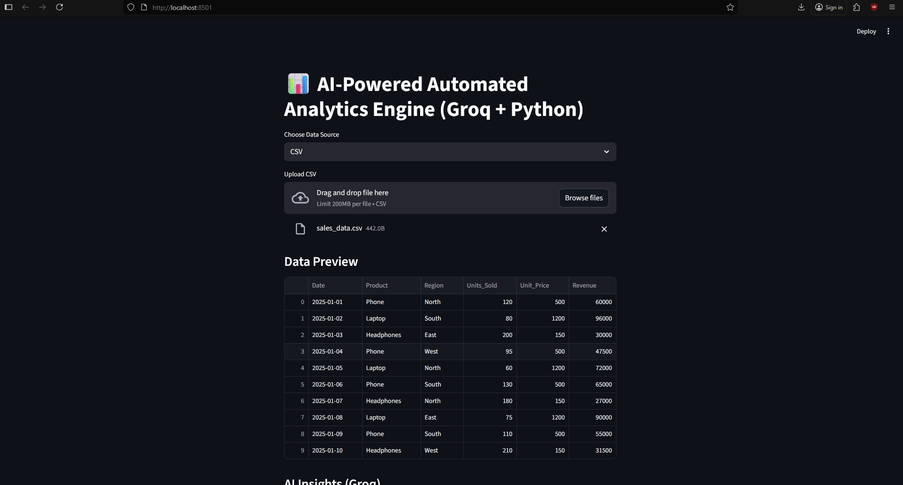
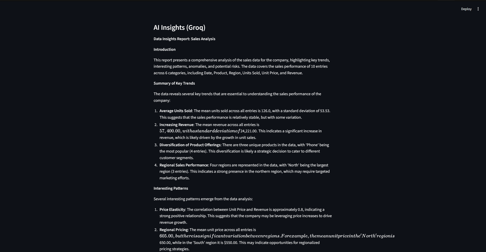
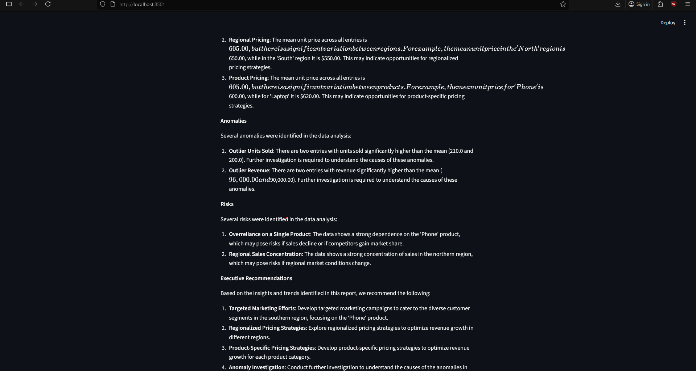
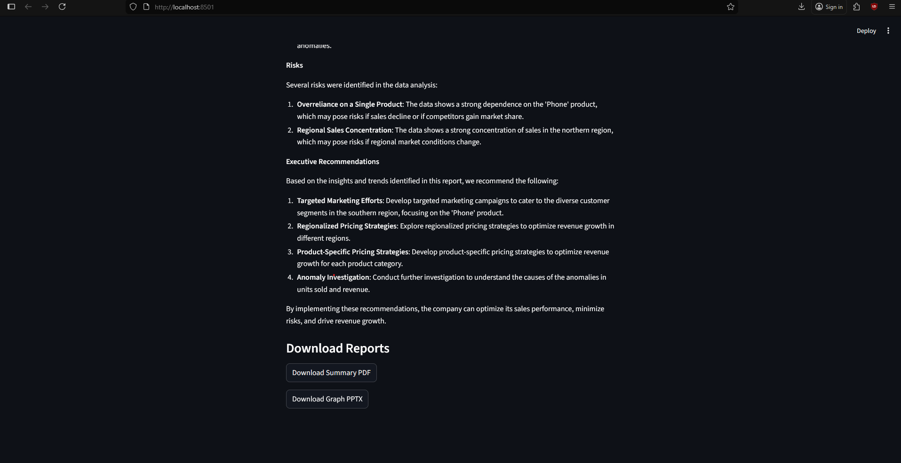
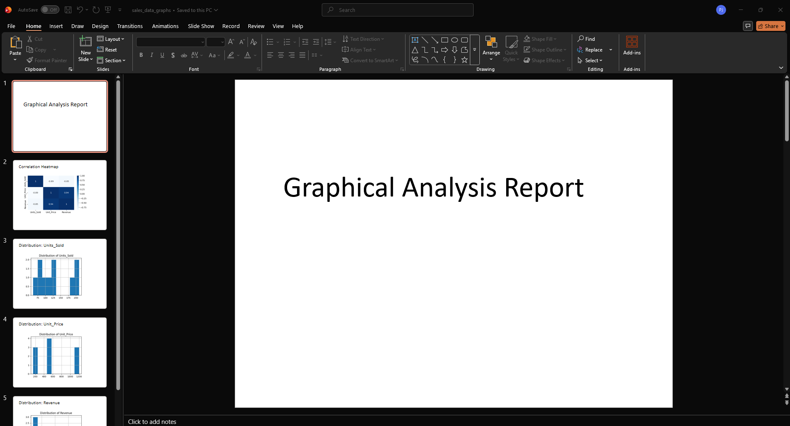
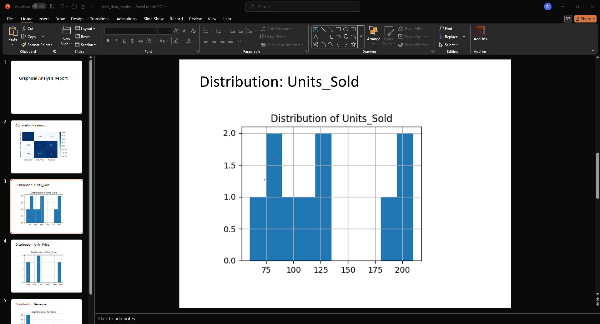

# AutoReport AI: Automated Analytics & Insight Engine
Upload a dataset → Get a clean executive-ready PPTX & PDF report with AI-powered insights in under 20 seconds.
## The Problem (Real-World Scenario)

Across Finance, Operations, Marketing, and Analytics teams, thousands of CSV files are generated daily.

Yet analysts still spend 3–6 hours per week manually:

* Loading CSVs

* Exploring data

* Making charts

* Writing insights

* Formatting reports

* Slow. Repetitive. Error-prone.

* Pain Point

* Executives receive insights too late, and analysts lose valuable time doing mechanical, tedious work.

## My Solution: AutoReport AI

A fully automated reporting system where you simply:

Upload → Process → Download a Complete Report

AutoReport AI instantly generates:

1. A professionally designed PPTX report

2. A structured PDF report

3. AI-written executive insights

4. Automatic charts & correlations

Everything is clean, formatted, and presentation-ready.

## Expected End Result
* Input: Upload any CSV/JSON file.
* Action: Wait ~20 seconds.
* Output: Downloads containing:

    1. PDF Report (Text-Only Report)

        * The PDF file contains:

        * Dataset Summary

        * Rows, columns, missing values

        * Clean descriptive information

        * AI-Generated Insights

        * Recommendations & observed patterns
    
    2. PPTX Report (Visual Analytics Only)

        * The PPTX file contains:

        * Correlation Heatmap

        * Distribution Histograms (one slide per column)

        * Clean visual-only layout

        * Full-size, properly scaled plots

* Saved inside:
`output/<dataset_name>/`

## Technical Approach

AutoReport AI is built like a mini-analytics pipeline:

### 1. Ingestion Engine

Supports:

* CSV

* JSON

* SQL databases

* SQLite

Designed to mimic enterprise ETL ingestion patterns.

### 2. Data Processing (Pandas)

Automatic generation of:

* Descriptive statistics

* Missing value summary

* Numeric distribution plots

* Correlation matrix

### 3. Insight Generation (Groq Llama 3.1 – 8B Instant)

The AI model performs:

* Structured narrative writing

* Numbered insights

* Executive tone of voice

* Zero hallucination formatting

Strict cleaning rules ensure AI content looks like a real analyst wrote it.

### 4. Reporting Engine
* #### PPTX Generator (python-pptx)

    * Clean paragraphs (no bullets)

    * Auto-shrink long text

    * Word wrapping enabled

    * XML bullet-removal

    * Plots embedded

* #### PDF Generator (ReportLab)

    * Clean paragraphs

    * Correct spacing

    * Images embedded in-flow

    * No formatting artifacts

### 4. Output Organization

Each dataset gets its own folder:

`output/<dataset_name>/
    <dataset_name>_report.pdf
    <dataset_name>_report.pptx`

## Tech Stack
* Language: Python 3.10
* Data Engine: Pandas
* AI Model: Groq Llama 3.1 (8B Instant)
* PPT Render: python-pptx
* PDF Render: ReportLab
* Visualization: Matplotlib, Seaborn
* UI: Streamlit

## How to Run Locally
### 1. Clone Repository
* `git clone https://github.com/newblathe/GroundTruthHackathon.git`
* `cd GroundTruthHackathon/auto_report`
* #### NOTE: Replace the placeholder Groq API key inside `insights.py` with your actual Groq API key before running the application.

### 2. Create Conda Environment
`conda create -n auto_report python=3.10`
`conda activate auto_report`

### 3. Install Dependencies
`pip install -r requirements.txt`

### 4. Run Streamlit UI
`streamlit run app.py`

Upload any dataset → Generate reports → Download clean PPTX/PDF.

## Visual Proof (Screenshots)

### 1. Streamlit Application

### 2. Generated PDF Summary

### 3. Generated PPTX Graph Report

